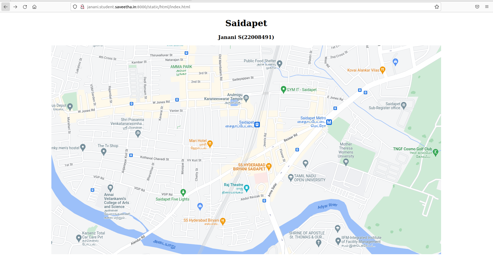
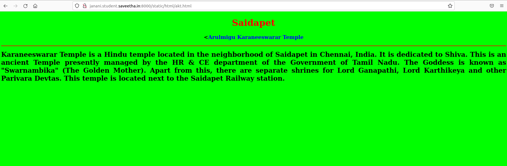
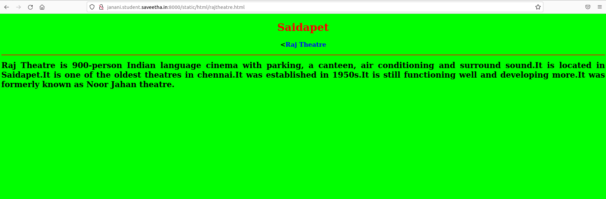
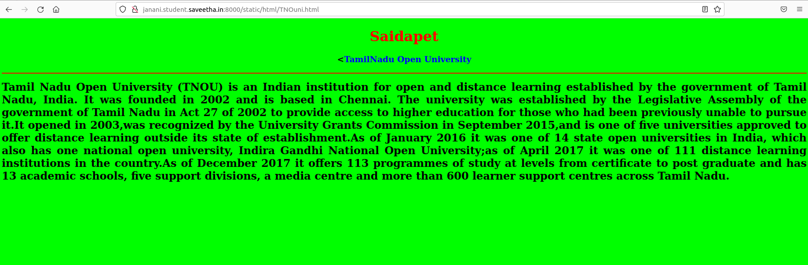
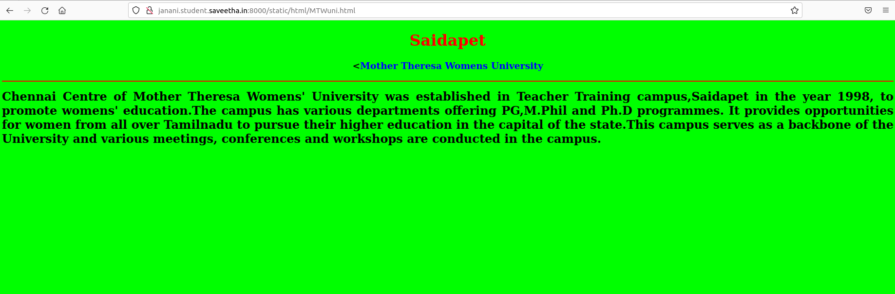
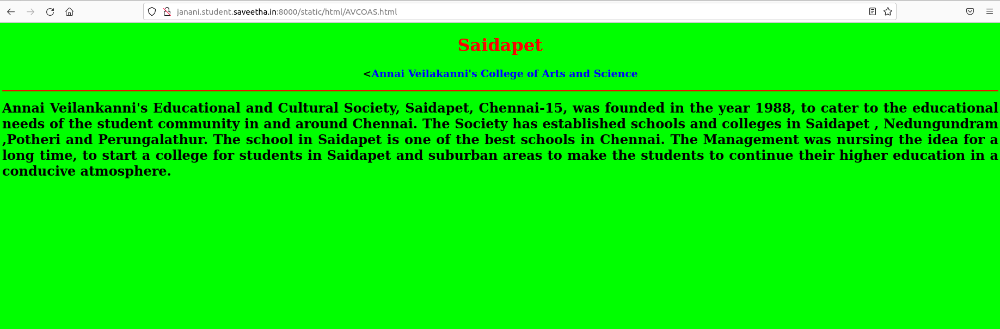

# Places Around Me
## AIM:
To develop a website to display details about the places around my house.

## Design Steps:

### Step 1:
Clone the places-around-me repository into the folder named imagemaps.Perform neccessary changes in settings.py.
### Step 2:
Create a folder named "static" in which folder named "html" has to be created and under which all required html files need to be created.
Code the main html program for the website and link all the other 5 html codes created regarding the places desciption
### Step 3:
Edit the readme.md file and push the files to the Github to display contents for the same
## Code:
#IN index.html
```
<!DOCTYPE html>
<html lang="en">
    <head>
        <title>My City</title>
    </head>
    <body>
        <h1 align="center">
            <font colour="red"><b>Saidapet</b></font>
        </h1>
        <h3 align="center">
            <font colour="blue"><b>Janani S(22008491)</b></font>
        </h3>
        <center>
            
<map name="image-maps-2023-01-12-075802" id="ImageMapsCom-image-maps-2023-01-12-075802">
<area  alt="" title="MOTHER THERESA WOMENS UNIVERSITY" href="MTWuni.html" shape="rect" coords="1052,334,1153,468" style=1"outline:none;" target="_self"     />
<area  alt="" title="TAMIL NADU OPEN UNIVERSITY" href="TNOuni.html" shape="rect" coords="865,464,1030,530" style="outline:none;" target="_self"     />
<area  alt="" title="ARULMIGU KARANEESWARAR TEMPLE" href="akt.html" shape="rect" coords="563,160,747,245" style="outline:none;" target="_self"     />
<area  alt="" title="ANNAI VEILAKANNI COLLEGE OF ARTS AND SCIENCE" href="AVCOAS.html" shape="rect" coords="178,516,348,613" style="outline:none;" target="_self"     />
<area  alt="" title="RAJ THEATRE" href="rajtheatre.html" shape="rect" coords="621,493,751,566" style="outline:none;" target="_self"     />
<area shape="rect" coords="1454,780,1456,782" alt="Image Map" style="outline:none;" title="Image Map" href="https://www.image-maps.com/" />
 </map>
        </center>
    </body>
</html>
```
#IN akt.html
```
<!DOCTYPE html>
<html lang="en">
    <head>
        <title>Arulmigu Karaneeswarar Temple</title>
    </head>
    <body bgcolor="Lime">
        <h1 align="center">
            <font color="red"><b>Saidapet</b></font>
        </h1>
        <h3 align="center">
            <<font color="blue"><b>Arulmigu Karaneeswarar Temple</b></font>
        </h3>
        <hr size="3" color="red">
        <p align="justify">
            <font face="San serifs" size="5">
                <b>
                Karaneeswarar Temple is a Hindu temple located in the neighborhood of Saidapet in Chennai, India. It is dedicated to Shiva. This is an ancient Temple presently managed by the HR & CE department of the Government of Tamil Nadu. The Goddess is known as "Swarnambika" (The Golden Mother). Apart from this, there are separate shrines for Lord Ganapathi, Lord Karthikeya and other Parivara Devtas. This temple is located next to the Saidapet Railway station. 

</b>
            </font>
        </p>
    </body>
</html>
```
#IN MTW.html
```
<!DOCTYPE html>
<html lang="en">
    <head>
        <title>Mother Theresa Womens University</title>
    </head>
    <body bgcolor="Lime">
        <h1 align="center">
            <font color="red"><b>Saidapet</b></font>
        </h1>
        <h3 align="center">
            <<font color="blue"><b>Mother Theresa Womens University</b></font>
        </h3>
        <hr size="3" color="red">
        <p align="justify">
            <font face="San serifs" size="5">
                <b>
                    Chennai Centre of Mother Theresa Womens' University was established in Teacher Training campus,Saidapet in the year 1998, to promote womens' education.The campus has various departments offering PG,M.Phil and Ph.D programmes. It provides opportunities for women from all over Tamilnadu to pursue their higher education in the capital of the state.This campus serves as a backbone of the University and various meetings, conferences and workshops are conducted in the campus.

</b>
            </font>
        </p>
    </body>
</html>
```
#IN TNOuni.html
```
<!DOCTYPE html>
<html lang="en">
    <head>
        <title>TamilNadu Open University</title>
    </head>
    <body bgcolor="Lime">
        <h1 align="center">
            <font color="red"><b>Saidapet</b></font>
        </h1>
        <h3 align="center">
            <<font color="blue"><b>TamilNadu Open University</b></font>
        </h3>
        <hr size="3" color="red">
        <p align="justify">
            <font face="San serifs" size="5">
                <b>
                    Tamil Nadu Open University (TNOU) is an Indian institution for open and distance learning established by the government of Tamil Nadu, India. It was founded in 2002 and is based in Chennai.
The university was established by the Legislative Assembly of the government of Tamil Nadu in Act 27 of 2002 to provide access to higher education for those who had been previously unable to pursue it.It opened in 2003,was recognized by the University Grants Commission in September 2015,and is one of five universities approved to offer distance learning outside its state of establishment.As of January 2016 it was one of 14 state open universities in India, which also has one national open university, Indira Gandhi National Open University;as of April 2017 it was one of 111 distance learning institutions in the country.As of December 2017 it offers 113 programmes of study at levels from certificate to post graduate and has 13 academic schools, five support divisions, a media centre and more than 600 learner support centres across Tamil Nadu.
</b>
            </font>
        </p>
    </body>
</html>
```
#IN rajtheatre.html
```
<!DOCTYPE html>
<html lang="en">
    <head>
        <title>Raj Theatre</title>
    </head>
    <body bgcolor="Lime">
        <h1 align="center">
            <font color="red"><b>Saidapet</b></font>
        </h1>
        <h3 align="center">
            <<font color="blue"><b>Raj Theatre</b></font>
        </h3>
        <hr size="3" color="red">
        <p align="justify">
            <font face="San serifs" size="5">
                <b>
                    Raj Theatre is 900-person Indian language cinema with parking, a canteen, air conditioning and surround sound.It is located in Saidapet.It is one of the oldest theatres in chennai.It was established in 1950s.It is still functioning well and developing more.It was formerly known as Noor Jahan theatre.
</b>
            </font>
        </p>
    </body>
</html>
```
#IN AVCOAS.html
```
<!DOCTYPE html>
<html lang="en">
    <head>
        <title>Annai Veilakanni's College of Arts and Science</title>
    </head>
    <body bgcolor="Lime">
        <h1 align="center">
            <font color="red"><b>Saidapet</b></font>
        </h1>
        <h3 align="center">
            <<font color="blue"><b>Annai Veilakanni's College of Arts and Science</b></font>
        </h3>
        <hr size="3" color="red">
        <p align="justify">
            <font face="San serifs" size="5">
                <b>
                    Annai Veilankanni's Educational and Cultural Society, Saidapet, Chennai-15, was founded in the year 1988, to cater to the educational needs of the student community in and around Chennai. The Society has established schools and colleges in Saidapet , Nedungundram ,Potheri and Perungalathur. The school in Saidapet is one of the best schools in Chennai. The Management was nursing the idea for a long time, to start a college for students in Saidapet and suburban areas to make the students to continue their higher education in a conducive atmosphere.

</b>
            </font>
        </p>
    </body>
</html>
```

## Output:






## Result:
Hence a website to display details about the places around my house has been developed successfully.